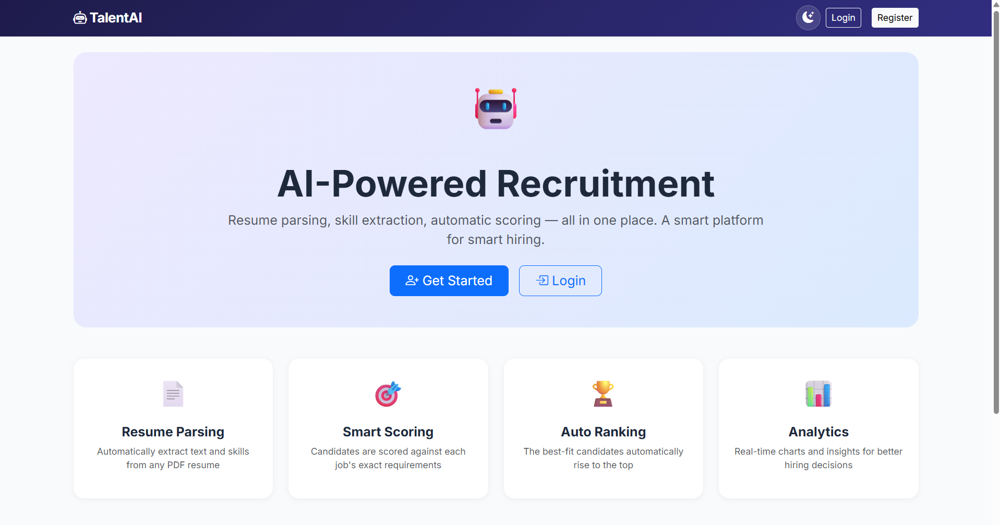
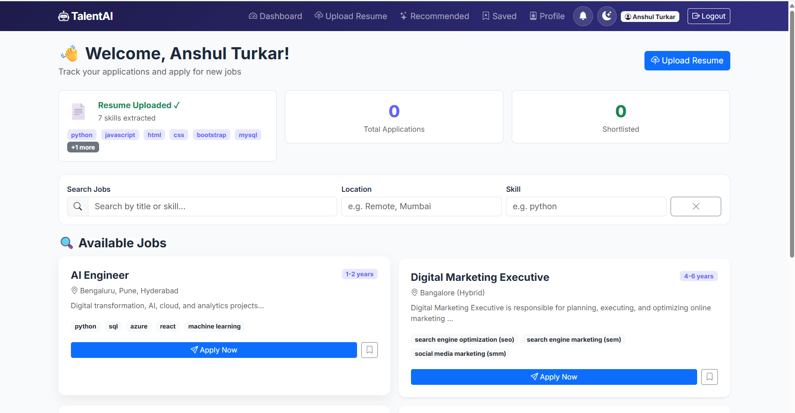
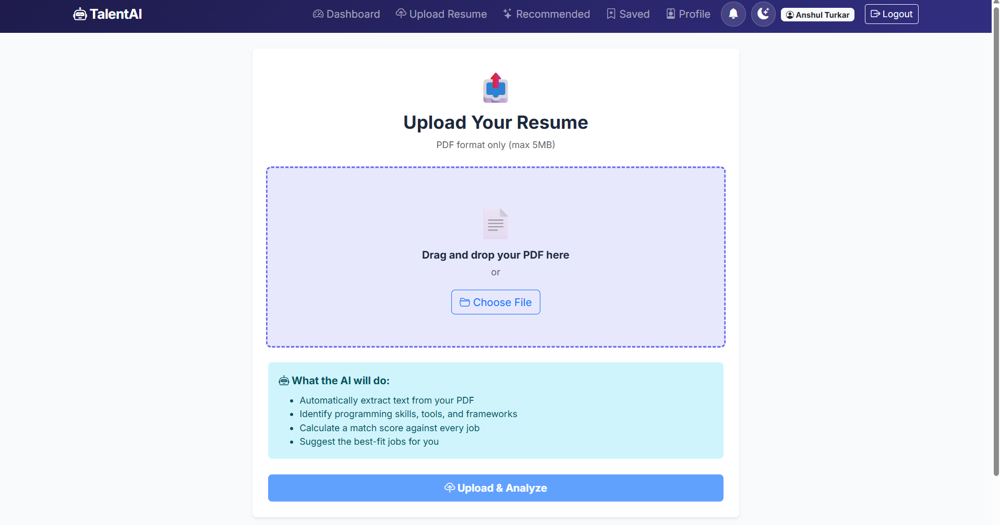
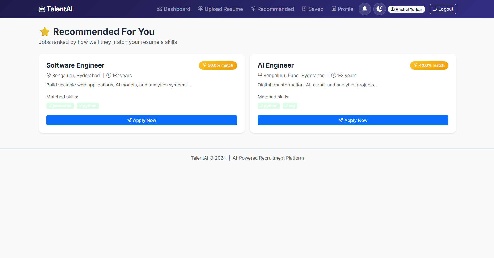
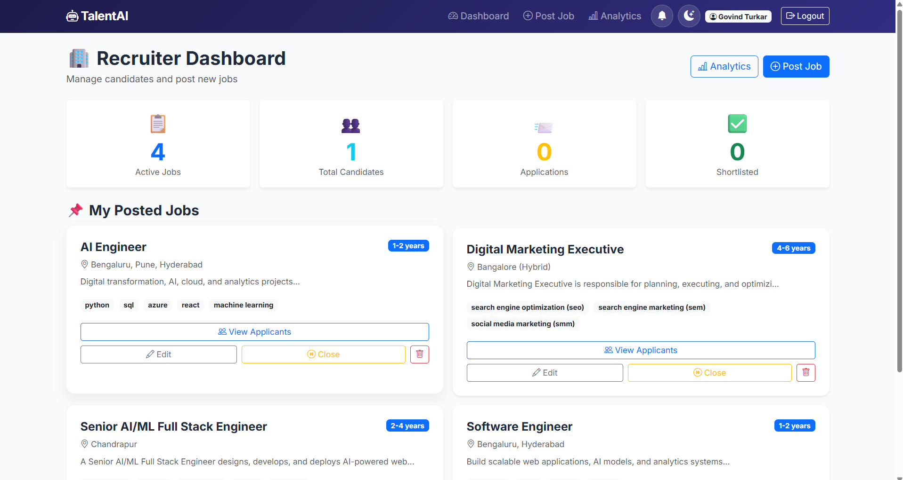
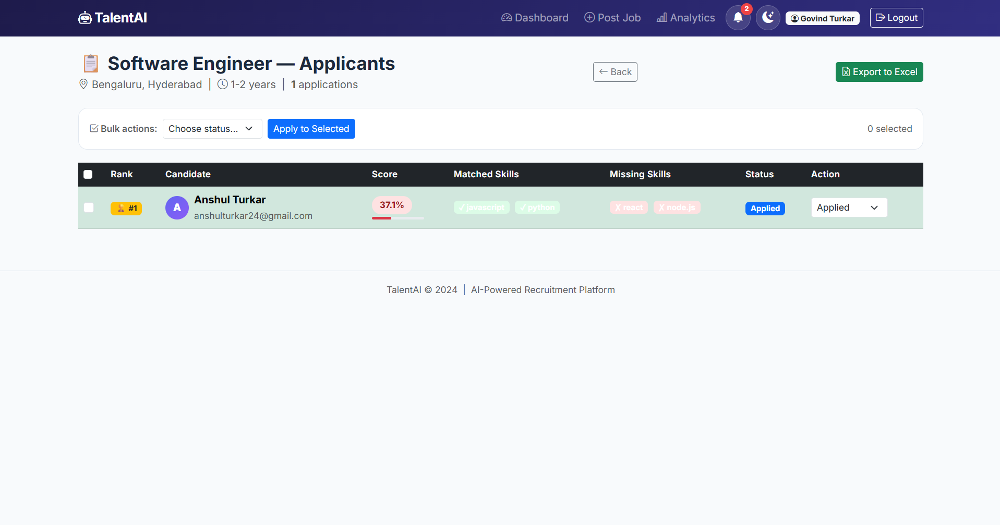
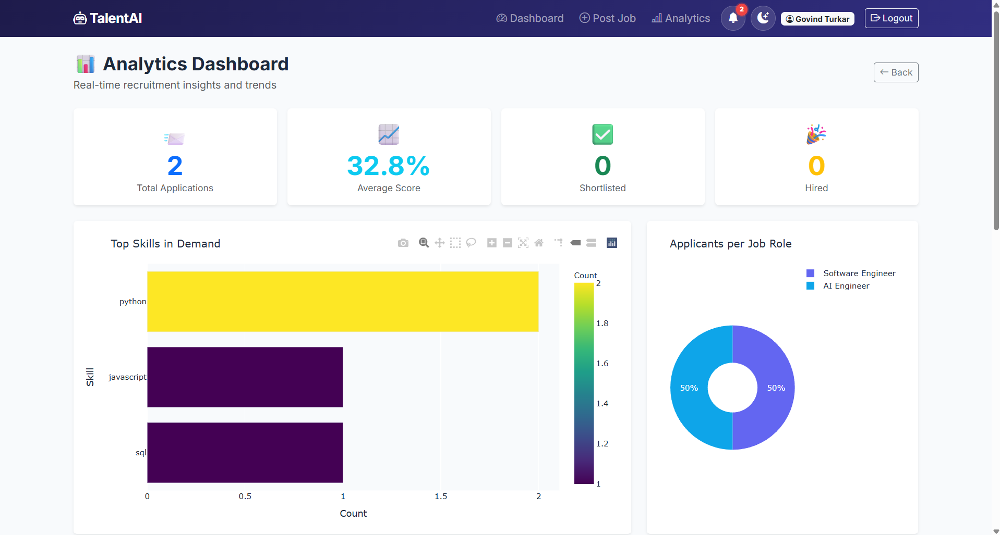
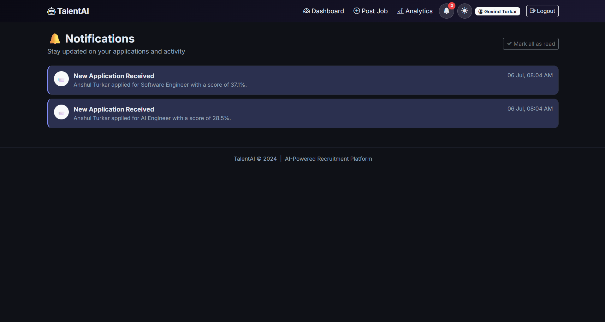

<div align="center">


<br/>

### Automate your entire hiring pipeline with AI — parse resumes, extract skills, score candidates, and rank them instantly.

<br/>

[](https://python.org)
[](https://flask.palletsprojects.com)
[](https://mysql.com)
[](https://scikit-learn.org)
[](https://render.com)

<br/>

[](https://talentai-recruitment-platform.onrender.com)
[](https://opensource.org/licenses/MIT)

<br/>

**[🌐 Live Demo](#-live-demo) · [✨ Features](#-features) · [📸 Screenshots](#-screenshots) · [⚙️ Setup](#%EF%B8%8F-installation) · [📬 Contact](#-contact)**

</div>

---

## 🌐 Live Demo

> ### 🔗 **[https://talentai-recruitment-platform.onrender.com](https://talentai-recruitment-platform.onrender.com)**

Register with any email to explore as a **Candidate**. The **Recruiter** dashboard is restricted to the admin account only, keeping the platform secure and realistic.

> ⏳ **Note:** The app is hosted on a free tier, so the first load after a period of inactivity may take 30–50 seconds while the server wakes up. Subsequent loads are instant.

---

## 📖 About The Project

Hiring teams waste countless hours manually screening **hundreds of resumes** — a process that's slow, biased, and error-prone. **TalentAI** solves this by using **AI and Machine Learning** to automatically read resumes, extract skills, and score every candidate against a job's requirements — surfacing the best-fit people in seconds.

The platform has two sides:
- **Candidates** upload their resume, get AI-matched to jobs, and track applications in real time.
- **Recruiters** post jobs and receive an automatically ranked list of applicants, complete with match scores, analytics, and Excel export.

---

## 📸 Screenshots

<div align="center">

### 🏠 Homepage


### 👤 Candidate Dashboard


### 📄 Resume Upload


### ⭐ AI Job Recommendations


### 🏢 Recruiter Dashboard


### 🏆 Ranked Applicants


### 📊 Analytics Dashboard


### 🌙 Dark Mode


</div>

---

## ✨ Features

### 👤 For Candidates
- 📄 **Resume Upload** — drag & drop PDF, AI extracts skills automatically
- 🎯 **Smart Apply** — instant AI match score when applying to any job
- ⭐ **AI Job Recommendations** — best-fit jobs ranked by resume match %
- 🔖 **Saved Jobs** — bookmark jobs to apply later
- ↩️ **Withdraw Applications** — cancel anytime (except hired)
- 👤 **Profile Page** — bio, experience, LinkedIn / GitHub / portfolio links
- 🔔 **Real-time Notifications** — get alerts on shortlist / rejection / hire
- 🔍 **Search & Filter** — find jobs by title, location, or skill

### 🏢 For Recruiters (Admin Only)
- 💼 **Post & Manage Jobs** — create, edit, close, reopen, or delete listings
- 🏆 **AI-Ranked Candidates** — applicants auto-sorted by match score
- ☑️ **Bulk Actions** — shortlist / reject / hire multiple candidates at once
- 📥 **Export to Excel** — download the full applicant list as `.xlsx`
- 📊 **Analytics Dashboard** — 5 interactive charts (skill demand, scores, trends)
- 🔔 **Application Alerts** — notified instantly when someone applies

### 🤖 AI / ML Engine
- 📑 **PDF Parsing** — extracts raw text from resumes (PyPDF2)
- 🧠 **Skill Extraction** — matches against a 50+ skills database
- 📐 **Skill Match Score** — `matched / required × 100` (70% weight)
- 🔍 **TF-IDF Similarity** — resume vs job cosine similarity (30% weight)
- 🏅 **Final Score** — `(Skill × 0.7) + (TF-IDF × 0.3)`

### 🎨 Platform & Engineering
- 🌙 **Dark Mode** — full dark theme with smooth transitions
- 🔐 **Admin-Only Recruiter** — only the admin email can be a recruiter
- 🔑 **Forgot Password** — secure token-based password reset
- 🛡️ **Secure Config** — all secrets stored in environment variables
- ⚡ **Connection Pooling** — reused DB connections instead of opening a new one per request
- 🗂️ **Database Indexes** — indexed columns on all frequently queried fields
- ❤️ **Health Check** — `/healthz` endpoint for uptime monitoring

---

## 📊 How The Scoring Works

```python
# Skill Match (70% weight)
skill_score = len(matched_skills) / len(required_skills) * 100

# TF-IDF Cosine Similarity (30% weight)
tfidf_score = cosine_similarity(resume_text, job_description) * 100

# Final Score
final_score = (skill_score * 0.70) + (tfidf_score * 0.30)
```

**Example:**
```
Job requires : python, flask, mysql, javascript, html   →  5 skills
Resume has   : python, mysql, html, react               →  3 matched

Skill Score  = 3/5 × 100          = 60.0%
TF-IDF Score = (auto-calculated)   = 45.0%
Final Score  = (60×0.7)+(45×0.3)   = 55.5%   →  ⚠️ Review
```

| Score | Decision |
|:-----:|:--------:|
| ≥ 75% | ✅ Shortlist |
| 50–74% | ⚠️ Review |
| < 50% | ❌ Reject |

---

## 🛠️ Tech Stack

| Layer | Technology |
|-------|------------|
| **Backend** | Python 3.13, Flask, PyMySQL |
| **Database** | MySQL 8.4 (hosted on Aiven) |
| **Connection Pool** | DBUtils `PooledDB` |
| **AI / ML** | scikit-learn (TF-IDF + Cosine Similarity), PyPDF2 |
| **Analytics** | Plotly, Pandas |
| **Frontend** | Bootstrap 5.3, Vanilla JavaScript |
| **Auth** | Werkzeug (password hashing), Flask sessions |
| **Export** | openpyxl (Excel) |
| **Deployment** | Render (web service) + Aiven (MySQL), Gunicorn |
| **Security** | python-dotenv (.env for secrets), SSL DB connection |

---

## 📁 Project Structure

```
TalentAI/
├── app.py                     # Main Flask app (30 routes)
├── requirements.txt           # Python dependencies
├── Procfile                   # Deployment start command
├── runtime.txt                # Python version
├── .env.example               # Environment variable template
├── .gitignore
│
├── models/
│   └── resume_parser.py       # PDF parsing + skill extraction + scoring
├── analytics/
│   └── dashboard.py           # 5 Plotly chart generators
├── database/
│   └── schema.sql             # 8 MySQL tables
│
├── templates/                 # 17 Jinja2 HTML templates
│   ├── base.html              # Navbar, dark mode, notifications
│   ├── index.html             # Landing page
│   ├── login.html / register.html
│   ├── forgot_password.html / reset_password.html
│   ├── candidate_dashboard.html
│   ├── candidate_profile.html
│   ├── upload_resume.html
│   ├── job_recommendations.html
│   ├── saved_jobs.html
│   ├── notifications.html
│   ├── recruiter_dashboard.html
│   ├── post_job.html / edit_job.html
│   ├── view_applicants.html
│   └── analytics.html
│
├── static/
│   ├── css/style.css          # Dark mode + animations
│   └── js/main.js             # Theme toggle + filters
├── screenshots/               # README screenshots
└── uploads/                   # Uploaded resumes
```

---

## ⚙️ Installation

### Prerequisites
- Python 3.11+
- MySQL 8.0+

### Steps

```bash
# 1. Clone the repository
git clone https://github.com/govindturkar69-crypto/TalentAI-Recruitment-Platform.git
cd TalentAI-Recruitment-Platform

# 2. Create & activate a virtual environment
python -m venv venv
venv\Scripts\activate          # Windows
# source venv/bin/activate      # Mac/Linux

# 3. Install dependencies
pip install -r requirements.txt

# 4. Set up environment variables
cp .env.example .env
# Edit .env with your MySQL credentials

# 5. Create the database
mysql -u root -p < database/schema.sql

# 6. Run the app
python app.py
```

Open **http://localhost:5000** in your browser.

### Environment Variables (`.env`)
```env
MYSQL_HOST=localhost
MYSQL_PORT=3306
MYSQL_USER=root
MYSQL_PASSWORD=your_password
MYSQL_DB=recruitment_db
MYSQL_SSL=False
FLASK_SECRET_KEY=your_random_secret_key
FLASK_DEBUG=True
```

---

## 🗃️ Database Schema

| Table | Purpose |
|-------|---------|
| `users` | Candidates + Recruiters (role-based) |
| `jobs` | Job listings (with active/closed flag) |
| `resumes` | Uploaded PDFs + extracted skills |
| `applications` | Candidate ↔ Job links (score, status) |
| `candidate_profiles` | Bio, contact, social links |
| `notifications` | Real-time alerts |
| `saved_jobs` | Bookmarked jobs |
| `password_resets` | Secure reset tokens |

Indexed columns: `users.email`, `applications.candidate_id`, `applications.job_id`, `applications.status`, `jobs.recruiter_id`, `jobs.is_active`, `resumes.user_id`, `saved_jobs.candidate_id`, `notifications(user_id, is_read)`, `password_resets.token`.

---

## 🚀 Deployment

The app runs on a **fully free stack** — Render for the web service, Aiven for managed MySQL.

### 1. Database — Aiven
- Create a free MySQL service at [aiven.io](https://aiven.io)
- Run `database/schema.sql` to create the 8 tables
- Note the host, port, user, password, and database name

### 2. Web Service — Render
- Create a new **Web Service** at [render.com](https://render.com) and connect the GitHub repo
- **Build Command:** `pip install -r requirements.txt`
- **Start Command:** `gunicorn app:app`
- **Instance Type:** Free

### 3. Environment Variables on Render
```
MYSQL_HOST       = <your-aiven-host>.aivencloud.com
MYSQL_PORT       = <your-aiven-port>
MYSQL_USER       = avnadmin
MYSQL_PASSWORD   = <your-aiven-password>
MYSQL_DB         = <your-database-name>
MYSQL_SSL        = True
FLASK_SECRET_KEY = <random-secret-string>
FLASK_DEBUG      = False
```

> Aiven requires an SSL connection, which is why `MYSQL_SSL=True` is needed in production.

---

## 🗺️ Roadmap

- [x] AI resume parsing & skill extraction
- [x] Smart scoring (Skill Match + TF-IDF)
- [x] Automatic candidate ranking
- [x] Job posting & management (edit / close / delete)
- [x] Application tracking & withdrawal
- [x] Real-time notifications
- [x] Analytics dashboard (5 charts)
- [x] Candidate profile page
- [x] AI job recommendations
- [x] Saved / bookmarked jobs
- [x] Bulk status actions
- [x] Export applicants to Excel
- [x] Forgot password (token-based)
- [x] Dark mode
- [x] Search & filter jobs
- [x] Admin-only recruiter access
- [x] Database connection pooling & indexes
- [x] Health-check endpoint
- [x] Deployed live on Render + Aiven
- [ ] Email notifications (SMTP)
- [ ] Full UI redesign with a unified design system
- [ ] Admin panel for user management
- [ ] Resume improvement AI suggestions

---

## 📬 Contact

<div align="center">

**Govind Turkar**

[](https://github.com/govindturkar69-crypto)
[](mailto:govindturkar45@gmail.com)
[](https://linkedin.com/in/yourprofile)

</div>

---

## 📄 License

This project is licensed under the **MIT License** — free to use, modify, and distribute.

---

<div align="center">

### ⭐ If you found this project helpful, please give it a star!


</div>