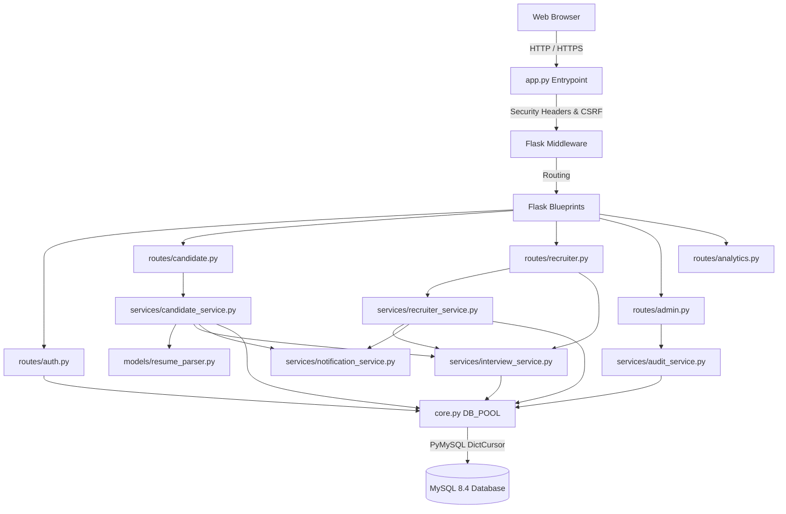
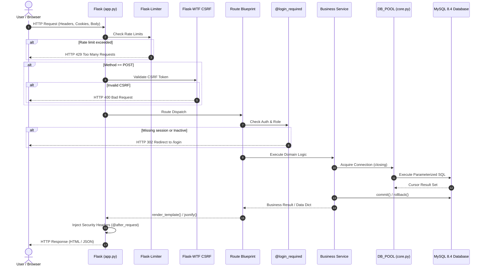
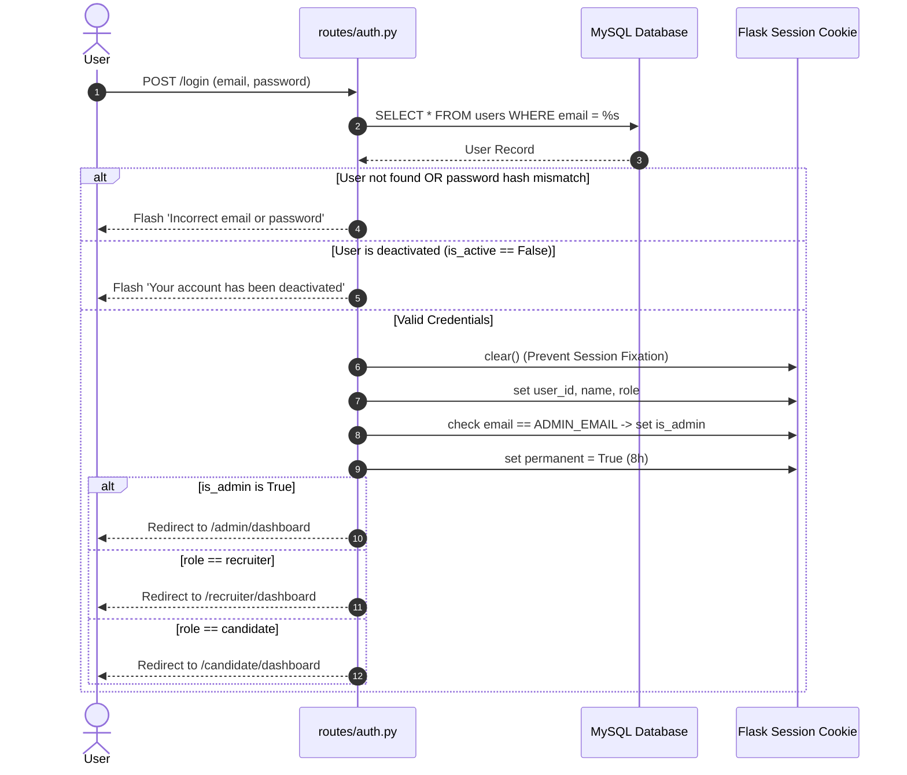
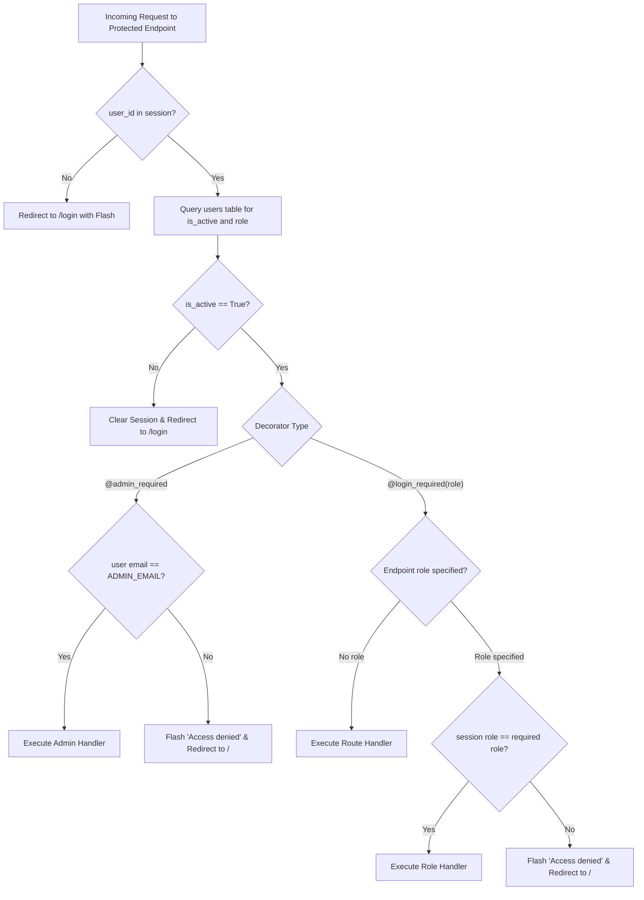
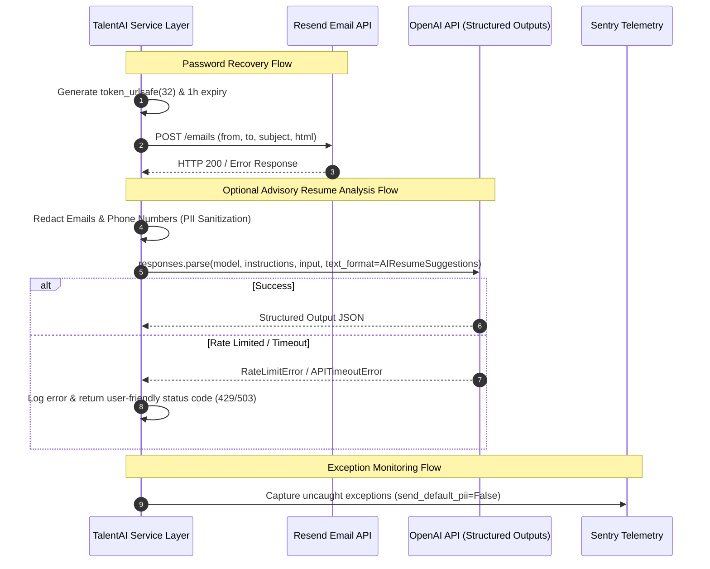

# System Architecture

## Documentation Basis

- Repository branch: `main`
- Repository HEAD: `891d7ac4947d7a4153d2da7389aabdaf116e3b52`
- Release snapshot: `v1.0.0`
- Analysis method: Static repository inspection
- Runtime verification: Present but not runtime-verified (documentation-only analysis)
- Generated/updated: `2026-09-11`

---

## Architecture Overview

**TalentAI** is structured as a modular monolithic web application. It integrates presentation, routing, application services, domain models, and relational data access into a unified Python codebase. The architecture is cleanly layered to isolate HTTP request parsing, business logic, deterministic machine learning models, and database persistence.

```
┌────────────────────────────────────────────────────────────────────────┐
│                        Client Browser / Frontend                       │
│      Bootstrap 5.3 + Custom CSS Tokens (Light/Dark) + Plotly.js        │
└───────────────────────────────────┬────────────────────────────────────┘
                                    │ HTTP / HTTPS (Jinja2 HTML + JSON)
                                    ▼
┌────────────────────────────────────────────────────────────────────────┐
│                       Flask Web Application (app.py)                   │
│   ┌────────────────────────────────────────────────────────────────┐   │
│   │ Security Middleware: CSRF, Rate Limiting, Security Headers     │   │
│   └───────────────────────────────┬────────────────────────────────┘   │
│                                   │ Dispatches
│                                   ▼
│   ┌────────────────────────────────────────────────────────────────┐   │
│   │                     Flask Blueprints (routes/)                 │   │
│   │   auth  │  candidate  │  recruiter  │  admin  │  analytics     │   │
│   └───────────────────────────────┬────────────────────────────────┘   │
│                                   │ Calls
│                                   ▼
│   ┌────────────────────────────────────────────────────────────────┐   │
│   │                   Business Service Layer (services/)           │   │
│   │ candidate_service │ recruiter_service │ interview_service      │   │
│   │ audit_service     │ email_service     │ ai_resume_service      │   │
│   │ notification_service                  │ workflow               │   │
│   └──────────────┬───────────────────────────────┬─────────────────┘   │
│                  │ Uses                          │ Uses                │
│                  ▼                               ▼                     │
│   ┌──────────────────────────────┐ ┌──────────────────────────────┐    │
│   │   Models & Parsing (models/) │ │ Core Connection Pool (core.py)│   │
│   │   resume_parser (pypdf,      │ │ DBUtils PooledDB + PyMySQL    │   │
│   │   scikit-learn TF-IDF)       │ └─────────────┬────────────────┘    │
│   └──────────────────────────────┘               │ Parameterized SQL   │
└──────────────────────────────────────────────────┼─────────────────────┘
                                                   │
                                                   ▼
                                    ┌─────────────────────────────┐
                                    │    MySQL 8.4 Relational DB  │
                                    │   (Users, Jobs, Apps, etc.) │
                                    └─────────────────────────────┘
```

---

## Architecture Pattern

- **Layered Monolith**: The application enforces a strict unidirectional dependency structure:
  $$\text{Templates/Static} \longleftrightarrow \text{Routes (Blueprints)} \longrightarrow \text{Services} \longrightarrow \text{Core / Models} \longrightarrow \text{Database}$$
- **Decoupled Blueprints**: Individual functional verticals (authentication, candidate workflows, recruiter operations, admin operations, analytics) are divided into separate Flask blueprints.
- **Service-Oriented Business Logic**: Routes remain lean, delegating complex validation, multi-step transactions, notification creation, and audit logging to dedicated service functions in `services/`.
- **Pure SQL Persistence**: Relational persistence bypasses heavyweight ORMs in favor of explicit, auditable, and parameterized SQL queries through `pymysql` DictCursors.
- **Dual Evaluation Paradigm**: Core scoring is 100% deterministic and local, with an optional advisory layer for generative AI suggestions that does not affect platform rankings.

---

## Repository Structure

```
TalentAI-Recruitment-Platform/
├── app.py                     # Application factory, middleware, public & health endpoints
├── config.py                  # Environment configuration and validation
├── core.py                    # Database connection pool and RBAC decorators
├── logging_config.py          # Structured logging and request context filters
├── runtime.txt                # Python runtime specification (3.11.9)
├── requirements.txt           # Production dependencies
├── requirements-dev.txt       # Development & testing dependencies
├── pyproject.toml             # Ruff, Black, and Pytest configuration
├── .env.example               # Safe environment variable configuration template
├── CHANGELOG.md               # Versioned changelog following Keep a Changelog
├── README.md                  # High-level project documentation
│
├── routes/                    # HTTP presentation layer (Flask Blueprints)
│   ├── __init__.py
│   ├── auth.py                # Authentication, registration, password recovery
│   ├── candidate.py           # Candidate profile, application, and job search routes
│   ├── recruiter.py           # Recruiter requisition, applicant, and interview routes
│   ├── admin.py               # Administrative console, users, companies, audit logs
│   └── analytics.py           # Recruiter visualization dashboard routes
│
├── services/                  # Business logic and domain service layer
│   ├── __init__.py
│   ├── ai_resume_service.py   # Optional OpenAI Structured Outputs advisor
│   ├── analytics_service.py   # Aggregation of recruiter metrics
│   ├── audit_service.py       # Append-only audit trail logging
│   ├── candidate_service.py   # Resume ingestion, job application, withdrawal
│   ├── email_service.py       # Resend transactional email delivery
│   ├── interview_service.py   # Interview lifecycle and terminal-state cancellation
│   ├── notification_service.py# In-app notification creation
│   ├── recruiter_service.py   # Candidate ranking, batch updates, Excel exports
│   └── workflow.py            # Centralized application status state machine
│
├── models/                    # Data parsing and deterministic ML
│   └── resume_parser.py       # PDF text extraction, skill matching, TF-IDF scoring
│
├── analytics/                 # Analytical visualization generation
│   └── dashboard.py           # Plotly chart generation (donut, bar, histogram)
│
├── database/                  # Database definitions and migrations
│   ├── schema.sql             # Full canonical DDL schema and initial seed data
│   └── migrations/            # Versioned SQL migration scripts (001 to 009)
│
├── static/                    # Frontend client assets
│   ├── css/
│   │   ├── style.css          # Core SaaS design system, dark mode tokens
│   │   ├── auth.css           # Authentication screen styling
│   │   └── landing.css        # Homepage styling
│   ├── js/
│   │   ├── main.js            # General UI behaviors, theme toggle, filters
│   │   └── auth.js            # Password strength and form behavior
│   └── favicon/               # SVG, ICO, and PNG branding assets
│
├── templates/                 # Jinja2 HTML5 templates
│   ├── base.html              # Base layout with navbar, notifications, theme engine
│   ├── index.html             # Landing page
│   ├── login.html             # User login
│   ├── register.html          # Candidate registration
│   ├── candidate_*.html       # Candidate portal views
│   ├── recruiter_*.html       # Recruiter portal views
│   ├── admin_*.html           # Administrator console views
│   ├── errors/                # Custom 404 and 500 error pages
│   └── ...                    # Specific functional templates
│
├── tests/                     # Automated test suite
│   ├── conftest.py            # Pytest configuration and database mocking fixtures
│   ├── fixtures/              # Database schema drift fixtures
│   └── test_*.py              # Unit, integration, security, and contract tests
│
└── uploads/                   # Runtime storage for uploaded candidate resume PDFs
```

---

## Major Modules

| Module | Location | Primary Responsibility |
|---|---|---|
| **App Core** | `app.py`, `core.py`, `config.py` | Config initialization, security headers, connection pooling, RBAC decorators. |
| **Auth Blueprint** | `routes/auth.py` | User onboarding, authentication, session lifecycle, password recovery. |
| **Candidate Blueprint** | `routes/candidate.py` | Candidate profile editing, resume upload, job applications, interview viewer. |
| **Recruiter Blueprint** | `routes/recruiter.py` | Job requisition management, candidate ranking, batch actions, Excel export. |
| **Admin Blueprint** | `routes/admin.py` | Operational telemetry, user governance, company management, audit logs. |
| **Analytics Module** | `routes/analytics.py`, `analytics/dashboard.py` | Data aggregation and Plotly figure generation. |
| **Resume Parser** | `models/resume_parser.py` | PDF parsing, 50+ skill extraction, TF-IDF vectorization, match scoring. |
| **Interview Service** | `services/interview_service.py` | Interview CRUD, validation, and terminal auto-cancellation logic. |
| **Audit Service** | `services/audit_service.py` | Whitelist-sanitized append-only compliance logging. |

---

## Module Responsibilities

- **`core.py`**: Owns the DBUtils `PooledDB` instance `DB_POOL` and the route security decorators `@login_required` and `@admin_required`. This breaks circular dependencies between `app.py` and the blueprints.
- **`models/resume_parser.py`**: Operates as a stateless mathematical and parsing utility. It has no dependencies on the database or Flask sessions.
- **`services/workflow.py`**: Acts as the single source of truth for allowable application status transitions (`CANDIDATE_TRANSITIONS`, `RECRUITER_TRANSITIONS`).
- **`services/candidate_service.py`**: Orchestrates resume processing, skill resolution precedence (curated profile skills over parsed resume skills), application creation, and self-service withdrawal.
- **`services/recruiter_service.py`**: Implements bulk application status transitions, transactional auto-cancellation triggers, and openpyxl spreadsheet construction.

---

## Component Relationships



---

## Request Lifecycle



---

## Authentication Flow



---

## Authorization Flow



---

## Candidate/User Flow

1. **Resume Ingestion**: Candidate uploads a PDF file $\rightarrow$ `secure_filename` assigns unique filename $\rightarrow$ saved to `uploads/` $\rightarrow$ `pypdf` extracts raw text $\rightarrow$ regex scans text against 50+ technical keywords $\rightarrow$ saved into `resumes`.
2. **Profile Completion**: Candidate edits profile bio, education, experience, projects, certifications, and achievements $\rightarrow$ URL validation ensures `http`/`https` $\rightarrow$ Date validation ensures `start_date <= end_date` $\rightarrow$ Profile completion percentage recalculated.
3. **Application & Scoring**: Candidate selects active job requisition $\rightarrow$ System retrieves resolved skills (curated profile skills take precedence over resume-extracted skills) $\rightarrow$ Skill score computed $\rightarrow$ TF-IDF cosine similarity computed against job description $\rightarrow$ Final score $(0.70 \times \text{Skill} + 0.30 \times \text{TF-IDF})$ stored in `applications` $\rightarrow$ Candidate and recruiter notified.
4. **Self-Service Withdrawal**: Candidate withdraws active application $\rightarrow$ State updated from `applied`/`shortlisted` to `withdrawn` $\rightarrow$ Any future scheduled interviews for this application are atomically cancelled $\rightarrow$ Audit event logged.

---

## Backend Flow

- **Request Parsing**: Blueprint routes parse form data (`request.form`), query parameters (`request.args`), and JSON payloads (`request.get_json(silent=True)`).
- **Service Invocation**: Routes invoke specialized functions in `services/`.
- **Database Context**: Services acquire connections from `DB_POOL` using Python's `contextlib.closing`.
- **Side Effects Coordination**: Within the same service transaction or immediately following commit:
  1. Transactional state updates executed.
  2. Terminal state auto-cancellations executed if status transitioned to `rejected`, `hired`, or `withdrawn`.
  3. Audit events dispatched to `log_audit_event()`.
  4. In-app notifications dispatched to `create_notification()`.

---

## Database Flow

- All queries use parameterized SQL placeholders (`%s`) to prevent injection.
- Concurrency control utilizes atomic state predicates and row locking:
  - `UPDATE applications SET status=%s WHERE id=%s AND status=%s`
  - `UPDATE companies SET is_active=%s WHERE id=%s AND is_active=%s`
  - `SELECT ... FOR UPDATE` utilized during interview scheduling and updates to prevent race conditions.
- Connections automatically returned to `DB_POOL` upon block exit via `closing(get_db_connection())`.

---

## External Service Flow



---

## Data Flow

```
[Uploaded Resume PDF]
         │ (pypdf text extraction)
         ▼
    [raw_text] ──────────► [Regex Skill Matcher] ──► [Detected Skills]
         │                                                    │
         │                                                    ▼
         │                                          [candidate_profiles]
         │                                          (Curated Skill Override)
         │                                                    │
         ▼                                                    ▼
[TfidfVectorizer]                                    [score_candidate()]
         │                                                    │
         ▼ (30% Weight)                                       ▼ (70% Weight)
  [TF-IDF Score]                                       [Skill Score]
         │                                                    │
         └───────────────────────┬────────────────────────────┘
                                 ▼
                         [Composite Score]
                                 │
                                 ▼
                        [applications Table]
                                 │
                                 ▼
                     [Recruiter Ranked Roster]
```

---

## Error Flow

1. **Client / Network Errors (404)**: Captured by `@app.errorhandler(404)` $\rightarrow$ Renders `templates/errors/404.html` with navigation back to homepage.
2. **Internal Server Errors (500)**: Captured by `@app.errorhandler(500)` $\rightarrow$ Renders `templates/errors/500.html` $\rightarrow$ Logs stack trace via `logging.getLogger(__name__).exception` $\rightarrow$ Dispatches telemetry to Sentry if configured.
3. **Database Failures**: Captured in try/except blocks $\rightarrow$ Transaction rolled back (`conn.rollback()`) $\rightarrow$ Error logged without exposing SQL details to the client $\rightarrow$ Safe flash alert returned.
4. **Validation Failures**: Invalid forms or bad parameters trigger early HTTP redirects with descriptive alert messages (`flash(..., "danger")`).

---

## Important Dependencies

- **`DBUtils.PooledDB`**: Foundation of scalable, multi-threaded connection management.
- **`scikit-learn`**: Powers core TF-IDF candidate match scoring.
- **`pypdf`**: Core text extraction engine for resume processing.
- **`openpyxl`**: Powers recruiter Excel exports.
- **`Flask-WTF` & `Flask-Limiter`**: Core edge security defenses for state mutations and authentication brute-force prevention.
- **`resend` & `openai`**: Decoupled third-party service SDKs with graceful fallback when unconfigured.
