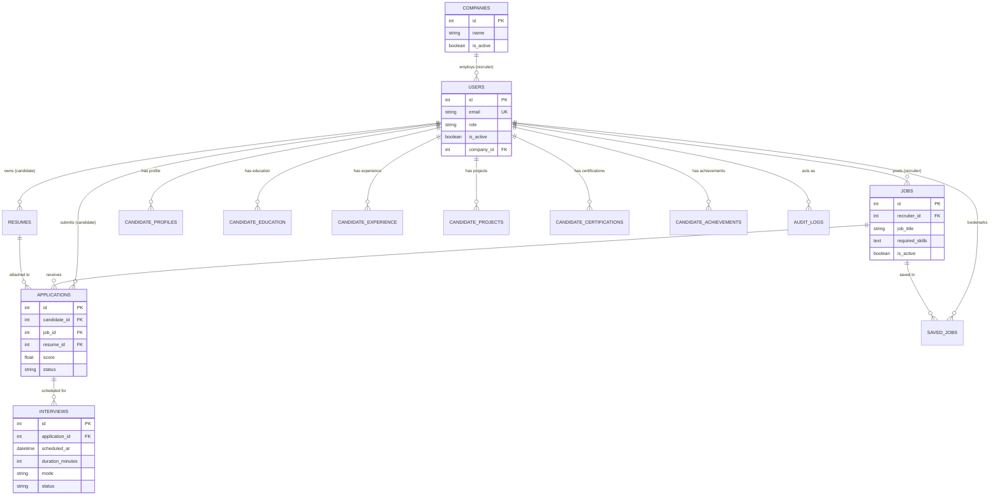

# Database Documentation

## Documentation Basis

- Repository branch: `main`
- Repository HEAD: `891d7ac4947d7a4153d2da7389aabdaf116e3b52`
- Release snapshot: `v1.0.0`
- Analysis method: Static repository inspection
- Runtime verification: Present but not runtime-verified (documentation-only analysis)
- Generated/updated: `2026-09-11`

---

## Database Overview

The TalentAI persistence layer is built on the **MySQL** relational database engine. The system organizes data across 14 canonical tables defined in `database/schema.sql`, supporting multi-tenant company accounts, role-based user profiles, job requisitions, candidate profile portfolios, resumes, applications with match scores, interview logistics, and compliance audit logs.

Additionally, runtime application code (`app.py`, `routes/auth.py`, `services/notification_service.py`) and `README.md` reference two auxiliary tables: `notifications` and `password_resets`. While these tables are actively accessed in application code, their DDL definitions are omitted from `database/schema.sql` and `database/migrations/`.

---

## Database Technology

- **Database Engine**: MySQL 8.4 (compatible with MySQL 8.0+)
- **Storage Engine**: InnoDB (default for MySQL 8; supports ACID transactions, row-level locking, foreign keys)
- **Character Set / Collation**: `utf8mb4` / `utf8mb4_unicode_ci` (recommended standard for full Unicode and emoji support)
- **Client Driver**: `pymysql` (version 1.1.0) with DictCursor
- **Connection Pooling**: `DBUtils.PooledDB` (version 3.1.0)
- **SSL / TLS**: Optional SSL connection encryption supported via `MYSQL_SSL=True` (configured for cloud providers such as Aiven)

---

## Schema Summary

| Table Name | Primary Purpose | Row Identity (PK) | Key Foreign Keys |
|---|---|---|---|
| `users` | Platform accounts (Candidates, Recruiters, Admin) | `id` (INT Auto) | `company_id` $\rightarrow$ `companies(id)` |
| `companies` | Multi-tenant organization entities | `id` (INT Auto) | None |
| `audit_logs` | Immutable audit trail for compliance | `id` (INT Auto) | `actor_user_id` $\rightarrow$ `users(id)` |
| `jobs` | Job requisitions posted by recruiters | `id` (INT Auto) | `recruiter_id` $\rightarrow$ `users(id)` |
| `resumes` | Uploaded resume files, raw text, and detected skills | `id` (INT Auto) | `user_id` $\rightarrow$ `users(id)` |
| `applications` | Job applications with composite match scores and pipeline status | `id` (INT Auto) | `candidate_id` $\rightarrow$ `users(id)`, `job_id` $\rightarrow$ `jobs(id)`, `resume_id` $\rightarrow$ `resumes(id)` |
| `interviews` | Multi-round candidate interview logistics | `id` (INT Auto) | `application_id` $\rightarrow$ `applications(id)` |
| `candidate_profiles` | Extended candidate bio, contact, and curated skills | `id` (INT Auto) | `user_id` $\rightarrow$ `users(id)` |
| `candidate_education` | Candidate academic history | `id` (INT Auto) | `user_id` $\rightarrow$ `users(id)` |
| `candidate_experience`| Candidate professional work history | `id` (INT Auto) | `user_id` $\rightarrow$ `users(id)` |
| `candidate_projects` | Candidate technical portfolio projects | `id` (INT Auto) | `user_id` $\rightarrow$ `users(id)` |
| `candidate_certifications`| Candidate professional certifications | `id` (INT Auto) | `user_id` $\rightarrow$ `users(id)` |
| `candidate_achievements`| Candidate honors and awards | `id` (INT Auto) | `user_id` $\rightarrow$ `users(id)` |
| `saved_jobs` | Candidate bookmarked job requisitions | `id` (INT Auto) | `candidate_id` $\rightarrow$ `users(id)`, `job_id` $\rightarrow$ `jobs(id)` |
| *`notifications`* | *In-app notifications (Runtime referenced; DDL omitted from schema.sql)* | `id` (INT Auto) | `user_id` $\rightarrow$ `users(id)` |
| *`password_resets`* | *Password recovery tokens (Runtime referenced; DDL omitted from schema.sql)* | `id` (INT Auto) | `user_id` $\rightarrow$ `users(id)` |

---

## Tables

### 1. `users`
- **Purpose**: Stores all platform user credentials, role assignments, activation flags, and tenant company associations.
- **Fields**:
  - `id`: `INT PRIMARY KEY AUTO_INCREMENT`
  - `name`: `VARCHAR(100) NOT NULL`
  - `email`: `VARCHAR(100) NOT NULL UNIQUE`
  - `password`: `VARCHAR(255) NOT NULL` (Werkzeug `scrypt` hash string)
  - `role`: `ENUM('candidate','recruiter') NOT NULL DEFAULT 'candidate'`
  - `is_active`: `BOOLEAN NOT NULL DEFAULT TRUE`
  - `company_id`: `INT NULL` (Foreign key to `companies.id`)
  - `created_at`: `DATETIME DEFAULT CURRENT_TIMESTAMP`
- **Foreign Keys**: `fk_user_company` on `company_id` REFERENCES `companies(id)` ON DELETE SET NULL
- **Indexes**: `idx_users_company_id (company_id)`

### 2. `companies`
- **Purpose**: Multi-tenant organizations associated with recruiters and job postings.
- **Fields**:
  - `id`: `INT PRIMARY KEY AUTO_INCREMENT`
  - `name`: `VARCHAR(255) NOT NULL`
  - `description`: `TEXT NULL`
  - `website`: `VARCHAR(255) NULL`
  - `logo_path`: `VARCHAR(255) NULL`
  - `is_active`: `BOOLEAN NOT NULL DEFAULT TRUE`
  - `created_at`: `DATETIME DEFAULT CURRENT_TIMESTAMP`
  - `updated_at`: `DATETIME DEFAULT CURRENT_TIMESTAMP ON UPDATE CURRENT_TIMESTAMP`

### 3. `audit_logs`
- **Purpose**: Immutable, append-only log of security, administrative, status, and interview changes.
- **Fields**:
  - `id`: `INT PRIMARY KEY AUTO_INCREMENT`
  - `actor_user_id`: `INT NULL`
  - `action`: `VARCHAR(255) NOT NULL`
  - `target_type`: `VARCHAR(100) NOT NULL`
  - `target_id`: `INT NULL`
  - `safe_details`: `TEXT NULL` (JSON string sanitized against allowlist)
  - `created_at`: `DATETIME DEFAULT CURRENT_TIMESTAMP`
- **Foreign Keys**: `FOREIGN KEY (actor_user_id) REFERENCES users(id) ON DELETE SET NULL`
- **Indexes**:
  - `idx_auditlogs_actor (actor_user_id)`
  - `idx_auditlogs_created (created_at)`

### 4. `jobs`
- **Purpose**: Job postings created and managed by recruiters.
- **Fields**:
  - `id`: `INT PRIMARY KEY AUTO_INCREMENT`
  - `recruiter_id`: `INT NOT NULL`
  - `job_title`: `VARCHAR(150) NOT NULL`
  - `required_skills`: `TEXT NOT NULL` (comma-separated lowercase skills)
  - `description`: `TEXT NULL`
  - `location`: `VARCHAR(100) NULL`
  - `experience`: `VARCHAR(50) NULL`
  - `is_active`: `BOOLEAN NOT NULL DEFAULT TRUE`
  - `created_at`: `DATETIME DEFAULT CURRENT_TIMESTAMP`
- **Foreign Keys**: `FOREIGN KEY (recruiter_id) REFERENCES users(id) ON DELETE CASCADE`

### 5. `resumes`
- **Purpose**: Metadata and text contents of uploaded PDF resumes.
- **Fields**:
  - `id`: `INT PRIMARY KEY AUTO_INCREMENT`
  - `user_id`: `INT NOT NULL`
  - `resume_path`: `VARCHAR(255) NOT NULL` (filename stored in `uploads/`)
  - `skills`: `TEXT NULL` (comma-separated list of extracted skills)
  - `raw_text`: `LONGTEXT NULL` (unmodified extracted plain text)
  - `created_at`: `DATETIME DEFAULT CURRENT_TIMESTAMP`
- **Foreign Keys**: `FOREIGN KEY (user_id) REFERENCES users(id) ON DELETE CASCADE`

### 6. `applications`
- **Purpose**: Submissions linking candidates to jobs, containing fit scores and current pipeline stage.
- **Fields**:
  - `id`: `INT PRIMARY KEY AUTO_INCREMENT`
  - `candidate_id`: `INT NOT NULL`
  - `job_id`: `INT NOT NULL`
  - `resume_id`: `INT NOT NULL`
  - `score`: `FLOAT DEFAULT 0` (composite fit score percentage)
  - `matched_skills`: `TEXT NULL`
  - `missing_skills`: `TEXT NULL`
  - `status`: `ENUM('applied', 'shortlisted', 'rejected', 'hired', 'withdrawn') NOT NULL DEFAULT 'applied'`
  - `applied_at`: `DATETIME DEFAULT CURRENT_TIMESTAMP`
- **Foreign Keys**:
  - `FOREIGN KEY (candidate_id) REFERENCES users(id) ON DELETE CASCADE`
  - `FOREIGN KEY (job_id) REFERENCES jobs(id) ON DELETE CASCADE`
  - `FOREIGN KEY (resume_id) REFERENCES resumes(id) ON DELETE CASCADE`

### 7. `interviews`
- **Purpose**: Scheduled interview rounds associated with active applications.
- **Fields**:
  - `id`: `INT PRIMARY KEY AUTO_INCREMENT`
  - `application_id`: `INT NOT NULL`
  - `scheduled_at`: `DATETIME NOT NULL`
  - `duration_minutes`: `SMALLINT UNSIGNED NOT NULL DEFAULT 30`
  - `mode`: `ENUM('online', 'in_person', 'phone') NOT NULL`
  - `location_or_link`: `VARCHAR(500) NULL`
  - `notes`: `TEXT NULL`
  - `status`: `ENUM('scheduled', 'completed', 'cancelled') NOT NULL DEFAULT 'scheduled'`
  - `created_at`: `DATETIME NOT NULL DEFAULT CURRENT_TIMESTAMP`
  - `updated_at`: `DATETIME NOT NULL DEFAULT CURRENT_TIMESTAMP ON UPDATE CURRENT_TIMESTAMP`
- **Foreign Keys**: `CONSTRAINT fk_interviews_application FOREIGN KEY (application_id) REFERENCES applications(id) ON DELETE CASCADE`
- **Indexes**:
  - `idx_interviews_application_scheduled (application_id, scheduled_at)`
  - `idx_interviews_status_scheduled (status, scheduled_at)`

### 8. `candidate_profiles`
- **Purpose**: Candidate background information and curated technical skill preferences.
- **Fields**:
  - `id`: `INT PRIMARY KEY AUTO_INCREMENT`
  - `user_id`: `INT NOT NULL`
  - `bio`: `TEXT NULL`
  - `phone`: `VARCHAR(20) NULL`
  - `location`: `VARCHAR(100) NULL`
  - `experience_years`: `VARCHAR(50) NULL`
  - `linkedin_url`: `VARCHAR(255) NULL`
  - `github_url`: `VARCHAR(255) NULL`
  - `portfolio_url`: `VARCHAR(255) NULL`
  - `skills`: `TEXT NULL` (candidate-curated skills that override resume parsing)
- **Foreign Keys**: `FOREIGN KEY (user_id) REFERENCES users(id) ON DELETE CASCADE`

### 9. `candidate_education`
- **Purpose**: Educational qualifications and degrees.
- **Fields**:
  - `id`: `INT PRIMARY KEY AUTO_INCREMENT`
  - `user_id`: `INT NOT NULL`
  - `institution`: `VARCHAR(255) NOT NULL`
  - `degree`: `VARCHAR(255) NULL`
  - `field_of_study`: `VARCHAR(255) NULL`
  - `start_date`: `DATE NULL`
  - `end_date`: `DATE NULL`
  - `created_at`: `DATETIME DEFAULT CURRENT_TIMESTAMP`
- **Foreign Keys**: `FOREIGN KEY (user_id) REFERENCES users(id) ON DELETE CASCADE`
- **Indexes**: `idx_cand_edu_userid (user_id)`

### 10. `candidate_experience`
- **Purpose**: Work and employment history records.
- **Fields**:
  - `id`: `INT PRIMARY KEY AUTO_INCREMENT`
  - `user_id`: `INT NOT NULL`
  - `company`: `VARCHAR(255) NOT NULL`
  - `title`: `VARCHAR(255) NOT NULL`
  - `description`: `TEXT NULL`
  - `start_date`: `DATE NULL`
  - `end_date`: `DATE NULL`
  - `is_current`: `BOOLEAN DEFAULT FALSE`
  - `created_at`: `DATETIME DEFAULT CURRENT_TIMESTAMP`
- **Foreign Keys**: `FOREIGN KEY (user_id) REFERENCES users(id) ON DELETE CASCADE`
- **Indexes**: `idx_cand_exp_userid (user_id)`

### 11. `candidate_projects`
- **Purpose**: Personal or professional portfolio projects.
- **Fields**:
  - `id`: `INT PRIMARY KEY AUTO_INCREMENT`
  - `user_id`: `INT NOT NULL`
  - `title`: `VARCHAR(255) NOT NULL`
  - `description`: `TEXT NULL`
  - `url`: `VARCHAR(500) NULL`
  - `technologies`: `TEXT NULL`
  - `created_at`: `DATETIME DEFAULT CURRENT_TIMESTAMP`
- **Foreign Keys**: `FOREIGN KEY (user_id) REFERENCES users(id) ON DELETE CASCADE`
- **Indexes**: `idx_cand_proj_userid (user_id)`

### 12. `candidate_certifications`
- **Purpose**: Professional licenses and certifications.
- **Fields**:
  - `id`: `INT PRIMARY KEY AUTO_INCREMENT`
  - `user_id`: `INT NOT NULL`
  - `name`: `VARCHAR(255) NOT NULL`
  - `issuer`: `VARCHAR(255) NULL`
  - `issue_date`: `DATE NULL`
  - `credential_url`: `VARCHAR(500) NULL`
  - `created_at`: `DATETIME DEFAULT CURRENT_TIMESTAMP`
- **Foreign Keys**: `FOREIGN KEY (user_id) REFERENCES users(id) ON DELETE CASCADE`
- **Indexes**: `idx_cand_cert_userid (user_id)`

### 13. `candidate_achievements`
- **Purpose**: Honors, awards, and notable accomplishments.
- **Fields**:
  - `id`: `INT PRIMARY KEY AUTO_INCREMENT`
  - `user_id`: `INT NOT NULL`
  - `title`: `VARCHAR(255) NOT NULL`
  - `description`: `TEXT NULL`
  - `achieved_date`: `DATE NULL`
  - `created_at`: `DATETIME DEFAULT CURRENT_TIMESTAMP`
- **Foreign Keys**: `FOREIGN KEY (user_id) REFERENCES users(id) ON DELETE CASCADE`
- **Indexes**: `idx_cand_ach_userid (user_id)`

### 14. `saved_jobs`
- **Purpose**: Persistent candidate job bookmarks.
- **Fields**:
  - `id`: `INT PRIMARY KEY AUTO_INCREMENT`
  - `candidate_id`: `INT NOT NULL`
  - `job_id`: `INT NOT NULL`
  - `saved_at`: `DATETIME DEFAULT CURRENT_TIMESTAMP`
- **Foreign Keys**:
  - `FOREIGN KEY (candidate_id) REFERENCES users(id) ON DELETE CASCADE`
  - `FOREIGN KEY (job_id) REFERENCES jobs(id) ON DELETE CASCADE`
- **Constraints**: `UNIQUE KEY unique_save (candidate_id, job_id)`

---

### Auxiliary Runtime-Referenced Tables (DDL Omitted from schema.sql)

#### `notifications` (Code Reference: `services/notification_service.py`, `app.py`)
- **Observed Query Usage**:
  - `INSERT INTO notifications (user_id, title, message, type) VALUES (%s,%s,%s,%s)`
  - `SELECT COUNT(*) AS cnt FROM notifications WHERE user_id = %s AND is_read = FALSE`
  - `SELECT * FROM notifications WHERE user_id = %s ORDER BY created_at DESC LIMIT 50`
  - `UPDATE notifications SET is_read = TRUE WHERE user_id = %s`
- **Inferred Schema**:
  - `id`: `INT PRIMARY KEY AUTO_INCREMENT`
  - `user_id`: `INT NOT NULL`
  - `title`: `VARCHAR(255)`
  - `message`: `TEXT`
  - `type`: `VARCHAR(50)`
  - `is_read`: `BOOLEAN DEFAULT FALSE`
  - `created_at`: `DATETIME DEFAULT CURRENT_TIMESTAMP`

#### `password_resets` (Code Reference: `routes/auth.py`)
- **Observed Query Usage**:
  - `INSERT INTO password_resets (user_id, token, expires_at) VALUES (%s,%s,%s)`
  - `SELECT * FROM password_resets WHERE token = %s AND used = FALSE`
  - `UPDATE password_resets SET used = TRUE WHERE user_id = %s AND used = FALSE`
  - `UPDATE password_resets SET used = TRUE WHERE id = %s`
- **Inferred Schema**:
  - `id`: `INT PRIMARY KEY AUTO_INCREMENT`
  - `user_id`: `INT NOT NULL`
  - `token`: `VARCHAR(255) NOT NULL`
  - `expires_at`: `DATETIME NOT NULL`
  - `used`: `BOOLEAN DEFAULT FALSE`
  - `created_at`: `DATETIME DEFAULT CURRENT_TIMESTAMP`

---

## Relationship Model



---

## Ownership / Authorization Relationships

1. **Recruiter Job Ownership**: Every row in `jobs` references `recruiter_id`. The application requires that a recruiter may only inspect, edit, or manage applications for jobs where `jobs.recruiter_id == session["user_id"]`.
2. **Company Tenant Association**: Recruiter accounts have `users.company_id` linked to `companies.id`. Candidate accounts must not have `company_id` set (enforced by `assign_company` in `routes/admin.py`).
3. **Candidate Data Ownership**: All sub-entities (`resumes`, `candidate_profiles`, `candidate_education`, etc.) enforce ownership by matching `user_id == session["user_id"]`.
4. **Audit Actor Tracking**: Administrative and lifecycle actions link `actor_user_id` to `users.id` with `ON DELETE SET NULL` to preserve historical audit logs if a user is deleted.

---

## Migration History

The database migration suite resides in `database/migrations/` and follows a sequential numbered format:

1. **`001_foundation.sql`**:
   - Creates `companies` table.
   - Adds `is_active` and `company_id` columns to `users`.
   - Adds `fk_user_company` foreign key and `idx_users_company_id` index.
   - Creates `audit_logs` table with actor and creation timestamp indexes.
2. **`002_candidate_profile.sql`**:
   - Adds `skills` column to `candidate_profiles`.
   - Creates `candidate_education`, `candidate_experience`, `candidate_projects`, `candidate_certifications`, and `candidate_achievements` tables with respective `user_id` indexes.
3. **`003_reconcile_foundation.sql`**:
   - Safe idempotency migration for production environments to reconcile missing Phase 1A foundation objects (`companies`, `users.is_active`, `users.company_id`, `audit_logs`).
4. **`004_job_lifecycle.sql`**:
   - Adds `is_active` boolean column to `jobs` table with default `TRUE`.
5. **`005_reconcile_candidate_profile.sql`**:
   - Normalizes production profile schema additions, creating missing `candidate_*` portfolio tables.
6. **`006_reconcile_job_lifecycle.sql`**:
   - Backfills existing `NULL` values in `jobs.is_active` to `1` (TRUE) and modifies column to `TINYINT(1) NOT NULL DEFAULT 1`.
7. **`007_add_saved_jobs.sql`**:
   - Creates `saved_jobs` bookmarking table with foreign keys to `users` and `jobs` and unique constraint `unique_save (candidate_id, job_id)`.
8. **`008_add_withdrawn_status.sql`**:
   - Modifies `applications.status` enum definition to include the `'withdrawn'` state:
     `ENUM('applied', 'shortlisted', 'rejected', 'hired', 'withdrawn') NOT NULL DEFAULT 'applied'`.
9. **`009_add_interviews.sql`**:
   - Creates `interviews` table with columns `scheduled_at`, `duration_minutes`, `mode`, `location_or_link`, `notes`, `status`, foreign key `fk_interviews_application`, and indexes `idx_interviews_application_scheduled` and `idx_interviews_status_scheduled`.

---

## Seed Data

`database/schema.sql` provides sample records for initial testing:
- **Recruiter Account**:
  - `name`: `'HR Admin'`
  - `email`: `'admin@company.com'`
  - `password`: `'pbkdf2:sha256:600000$example$hashedpassword'`
  - `role`: `'recruiter'`
- **Sample Jobs**:
  1. *Full Stack Developer* (Remote, 2-4 years, skills: `python,flask,mysql,javascript,html,css,rest api,git`)
  2. *Data Scientist* (Bangalore, 3-5 years, skills: `python,machine learning,pandas,sql,statistics,scikit-learn,tensorflow`)
  3. *Frontend Developer* (Mumbai, 1-3 years, skills: `javascript,react,html,css,typescript,git,rest api`)
  4. *Backend Developer* (Hyderabad, 2-4 years, skills: `python,django,mysql,rest api,docker,aws,git`)

---

## Validation

- **Application Uniqueness**: Enforced via application query check before inserting into `applications`.
- **Saved Jobs Uniqueness**: Enforced via database constraint `UNIQUE KEY unique_save (candidate_id, job_id)`.
- **User Email Uniqueness**: Enforced via `UNIQUE KEY` on `users.email`.
- **Enums**: Validated at database level for `users.role`, `applications.status`, `interviews.mode`, and `interviews.status`.
- **Referential Integrity**: Cascading deletes (`ON DELETE CASCADE`) applied on candidate data sub-tables and application-linked interviews, while `ON DELETE SET NULL` is applied on `users.company_id` and `audit_logs.actor_user_id`.

---

## Important Query Patterns

### 1. Applicant Ranking Query (`routes/recruiter.py`)
```sql
SELECT a.*, u.name AS candidate_name, u.email,
       a.score, a.matched_skills, a.missing_skills, a.status
FROM applications a 
JOIN users u ON a.candidate_id = u.id
WHERE a.job_id = %s
ORDER BY a.score DESC;
```

### 2. Candidate Resolved Skills Precedence (`services/candidate_service.py`)
```sql
-- Step 1: Check curated profile skills first
SELECT skills FROM candidate_profiles WHERE user_id = %s;
-- Step 2: Fall back to latest parsed resume skills if profile skills are empty
SELECT skills FROM resumes WHERE user_id = %s ORDER BY created_at DESC LIMIT 1;
```

### 3. Future Scheduled Interview Auto-Cancellation (`services/interview_service.py`)
```sql
SELECT id, scheduled_at 
FROM interviews
WHERE application_id = %s
  AND status = 'scheduled'
  AND scheduled_at > NOW()
FOR UPDATE;

UPDATE interviews
SET status = 'cancelled'
WHERE id = %s AND status = 'scheduled';
```

### 4. Admin Paginated User Fetch (`routes/admin.py`)
```sql
SELECT u.id, u.name, u.email, u.role, u.is_active, u.created_at,
       u.company_id, c.name as company_name
FROM users u
LEFT JOIN companies c ON u.company_id = c.id
WHERE ...
ORDER BY u.created_at DESC, u.id DESC
LIMIT %s OFFSET %s;
```

---

## Data Lifecycle

1. **User Ingestion**: Created as `candidate` via `/register`. Role modified to `recruiter` via admin console. Deletion is not exposed in UI; user deactivation is achieved by setting `is_active = FALSE`.
2. **Resume Archival**: Resumes are linked to `user_id`. Multiple uploads are allowed; the latest resume is used for new applications, but prior application records retain their original `resume_id` pointer.
3. **Application Lifecycle**: Moves from `applied` $\rightarrow$ `shortlisted` $\rightarrow$ terminal (`hired`, `rejected`, or `withdrawn`).
4. **Interview Retention**: Cancelled and completed interviews are permanently retained in `interviews` for auditing and historical candidate reporting.
5. **Audit Immutability**: Rows in `audit_logs` are insert-only; no update or delete routes exist.

---

## Known Database Constraints / Limitations

1. **Missing DDL in Schema File**: Tables `notifications` and `password_resets` are actively queried by application code and documented in README, but are omitted from `database/schema.sql` and `database/migrations/`.
2. **Denormalized Skills Storage**: Skills are stored as comma-delimited strings in `jobs.required_skills`, `resumes.skills`, and `candidate_profiles.skills`, rather than in a normalized relational junction table (`skills` $\longleftrightarrow$ `entity_skills`).
3. **Application Duplicate Prevention**: Application duplicate checks are handled in application code rather than via an explicit `UNIQUE KEY (candidate_id, job_id)` constraint on the `applications` table.
